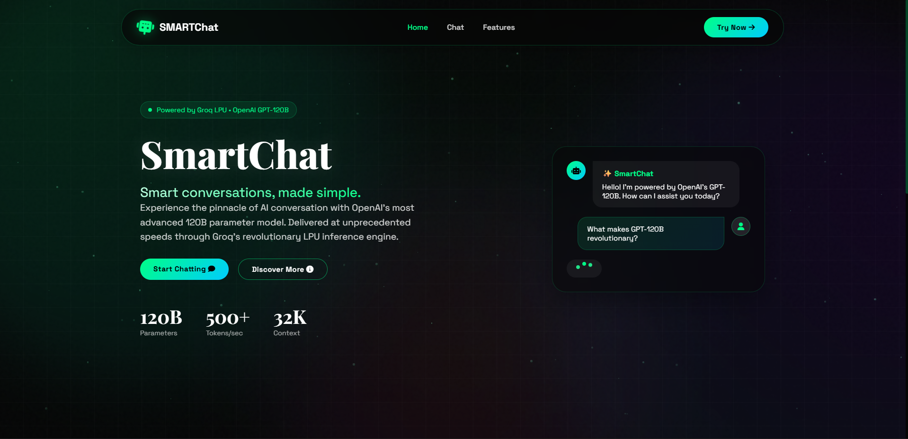
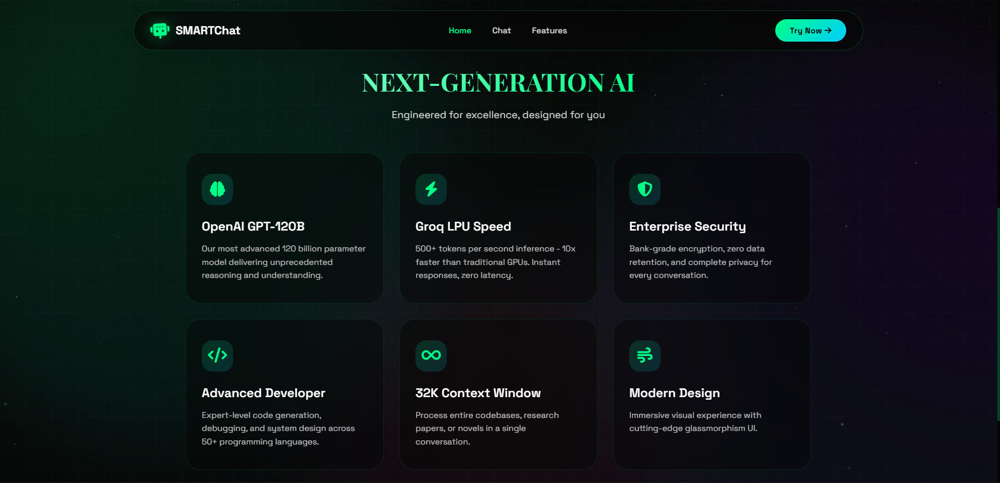
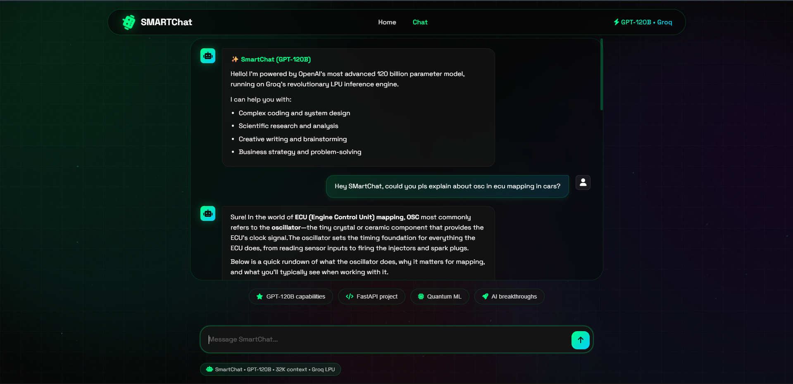

# SmartChat – AI Chatbot 🚀

SmartChat is a lightning-fast AI chat interface powered by **Groq LPU** and large language models, specifically, the OPENAI GPT OSS 120B.  
It features a **modern UI**, real-time responses, and a clean Flask-based backend.

## ✨ Features

- ⚡ Ultra-fast responses using Groq API
- 🤖 LLM-powered conversational AI
- 🎨 Modern UI with glassmorphism and particle effects
- 💬 Real-time chat interface
- 🐍 Flask backend (Python)
- 🔐 Environment-based API key configuration
- 📱 Responsive design

---

## 🛠 Tech Stack

**Frontend**
- HTML
- CSS
- JavaScript
- Glassmorphism UI

**Backend**
- Python
- Flask

**AI**
- Groq API
- OpenAI / compatible large language models

---

## 📂 Project Structure

```
SmartChat-AI-Chatbot/
│
├── app.py # Flask backend
├── requirements.txt # Python dependencies
├── .env.example # Environment variables template
│
├── templates/ # HTML files
├── static/ # CSS, JS, assets
└── README.md
```
---

## ⚙️ Installation & Setup

### 1. Clone the repository

```bash
git clone https://github.com/SiddheshK1704/SmartChat-AI-Chatbot.git
cd SmartChat-AI-Chatbot
```

---

### 2. Create a virtual environment (recommended)

```bash
python -m venv venv
```

### Activate it:

Windows

```bash
venv\Scripts\activate
```

Mac/Linux

```bash
source venv/bin/activate
```

---

### 3. Install dependencies
```bash
pip install -r requirements.txt
```

---

### 4. Setup Environment Variables

Create a .env file and add:

```
GROQ_API_KEY=your_api_key_here
```


You can get your API key from:
https://console.groq.com/

---

### 5. Run the application

```bash
python app.py
```

Open your browser and go to:

http://127.0.0.1:5000

---

### Preview

#### Home Screen


#### Features


#### AI Response


---

### 🚀 Future Improvements

- Chat history storage

- User authentication

- Deploy on Render / Vercel / AWS

- Streaming responses

- Multiple model selection

---

### 🧑‍💻 Author

Siddhesh Khankhoje
B.Tech CSE (AI & ML) – SRM University

GitHub: https://github.com/SiddheshK1704

